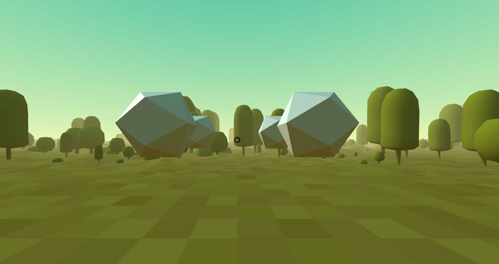

# 🎯 WebXR FPV Shooting Game



## 🚀 About the Project
WebXR FPV Shooting Game is an immersive first-person shooter built using A-Frame, leveraging WebXR to deliver an engaging and interactive VR experience. With eight unique 3D environments, players can explore, aim, and shoot in an exciting virtual world.

---

## 🌟 Features
✅ **First-Person View (FPV):** Experience a thrilling shooting game in a fully immersive VR world.  
✅ **WebXR & A-Frame Integration:** Built with the latest WebXR and A-Frame technologies.  
✅ **8 Unique 3D Environments:** Explore different adventurous themes.  
✅ **Easy Controls:** Simple keyboard and mouse navigation for intuitive gameplay.  
✅ **Cross-Platform:** Playable on VR headsets, desktops, and mobile devices.  

---

## 🎮 How to Play
🕹 **Controls:**
- **🔫 Spacebar** - Shoot at targets
- **🎮 Arrow Keys** - Move forward, backward, left, and right
- **🖱 Mouse Movement** - Navigate through the 3D environment

👨‍💻 **Playing Online:**
- Simply open the game in your browser and start playing!
- For an optimal experience, use a VR headset.

💡 **Pro Tips:**
- Aim quickly and react fast to moving targets.
- Explore different environments to find hidden targets.
- Practice to improve your reaction speed!

---

## 📸 Gameplay GIF


---

## 📂 Installation & Setup
1. Clone the repository:
   ```sh
   git clone https://github.com/hammaadworks/xr-fpv-shooting-game.git
   ```
2. Navigate to the project directory:
   ```sh
   cd xr-fpv-shooting-game
   ```
3. Open `index.html` in your browser to start playing.

🔗 **Play Online:**
👉 **Visit: https://hammaadworks.github.io/xr-fpv-shooting-game/ or click the link below!**

👉 **[Play Now](https://hammaadworks.github.io/xr-fpv-shooting-game/)**

---

## 🛠️ How to Contribute
We welcome contributions to make this game even better! Here's how you can help:

### 📌 Steps to Contribute
1. **Fork the repository** by clicking the “Fork” button on GitHub.
2. **Clone your fork** to your local machine:
   ```sh
   git clone https://github.com/your-username/xr-fpv-shooting-game.git
   ```
3. **Create a new branch** for your feature:
   ```sh
   git checkout -b feature-branch
   ```
4. **Make your changes** and commit:
   ```sh
   git commit -m "Add new feature"
   ```
5. **Push to your fork** and submit a pull request:
   ```sh
   git push origin feature-branch
   ```
6. We will review your PR and merge it if everything looks great! 🎉

### 💡 Contribution Ideas
- Improve game mechanics & physics.
- Add new levels or environments.
- Optimize performance for a smoother experience.
- Enhance UI/UX for better player engagement.

---

## 🔧 Technologies Used
- **[A-Frame](https://aframe.io/)** - WebVR framework for building 3D experiences
- **WebXR** - Browser API for VR and AR experiences
- **HTML, CSS, JavaScript** - Core web technologies
- **Bootstrap** - Responsive design and UI enhancements

---

## 📜 License
This project is licensed under the MIT License. See the [LICENSE](LICENSE) file for details.

---

## 📬 Contact
📧 **Email:** hammaadworks@gmail.com\
💻 **GitHub:** [@hammaadworks](https://github.com/hammaadworks)  

---

⭐ **If you like this project, consider giving it a star on GitHub!** ⭐

